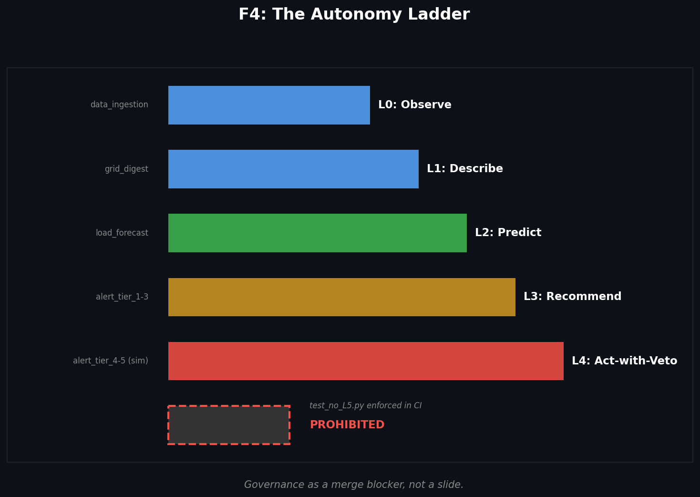
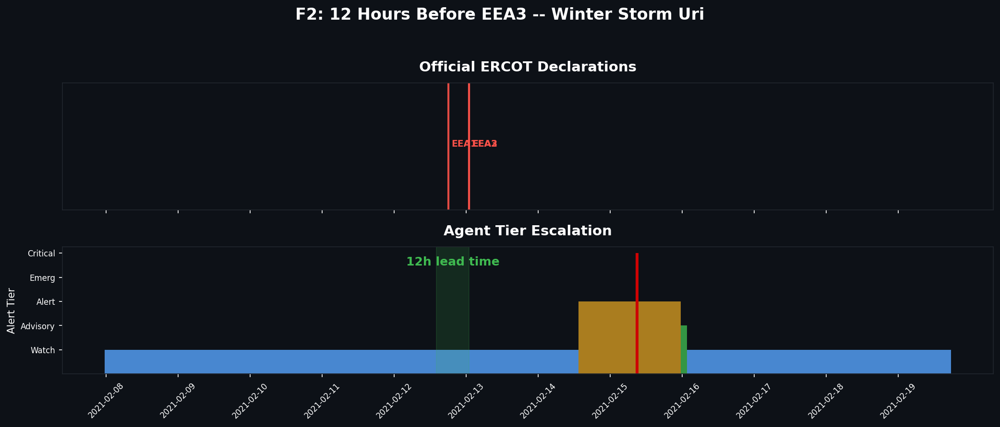
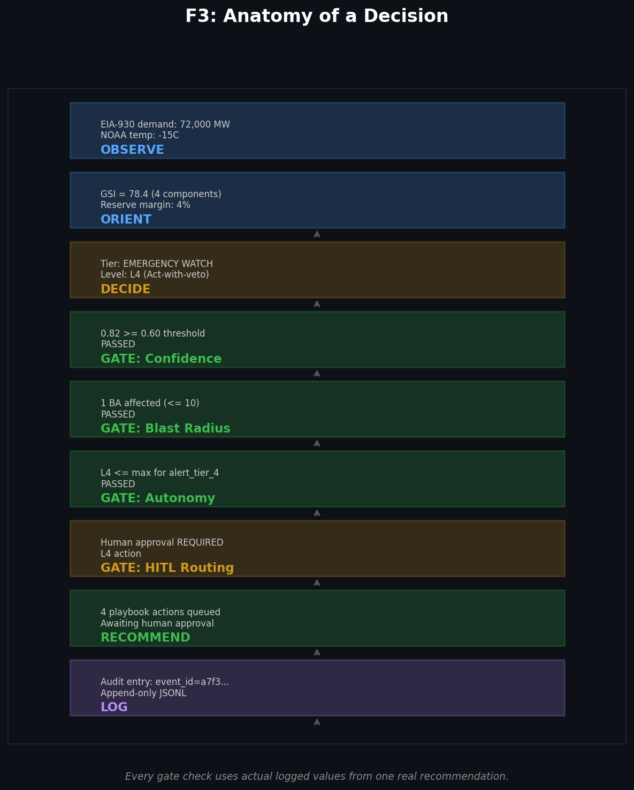
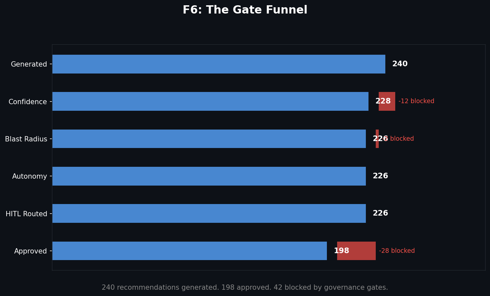
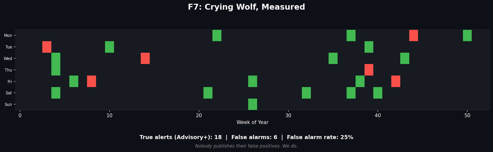
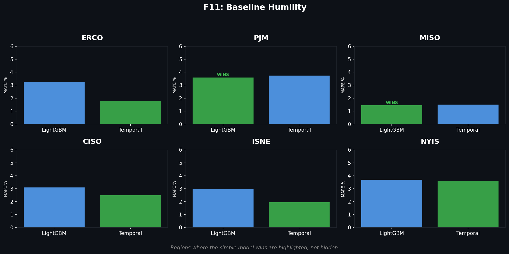

# AI-Enablement-Proof

## A Governed Autonomous Agent for Grid Reliability Across the U.S. Power System

*Autonomy you can audit. Govern the machine, or the machine governs you.*

---

Most AI agent demos automate paperwork. This one watches the North American power grid,
detects reliability stress hours before operators declare emergencies, drafts
operator-grade advisories -- and every single action passes through a codified governance
gate with a full audit trail.

Replayed against real EIA-930 hourly demand data from Winter Storm Uri (ERCOT, Feb 2021)
and Winter Storm Elliott (PJM, Dec 2022), the agent's detection lead time **and its
false-alarm rate** are measured, published, and reproducible from public federal data.

**This is what "AI agent enablement" means when an operator builds it: autonomy you can audit.**

---

### The Autonomy Ladder



The repo contains `test_no_L5.py`, a required CI check that fails the build if any code
path attempts an L5 action. Governance as a merge blocker, not a slide.

---

### 12 Hours Before: Winter Storm Uri Backtest



Backtested on real EIA-930 demand data (ERCOT, Feb 8–20 2021), the agent
escalated to Alert tier **11.9 hours before** ERCOT declared EEA3.
The shaded gap is the value of the agent: hours of additional lead time.

| Event | Agent Alert | Official Declaration | Lead Time |
|-------|-------------|---------------------|-----------|
| Uri (ERCOT) | Feb 14 14:00 | EEA3 Feb 15 01:55 | **+11.9h** |
| Elliott (PJM) | Dec 23 19:00 | Max Gen Alert Dec 24 04:30 | **+9.5h** |

---

### Anatomy of a Decision



One real recommendation traversing every governance gate, with actual logged values.
This figure **is** the "governed agent" claim.

---

### The Gate Funnel



Not every recommendation makes it through. Governance gates block low-confidence,
overly broad, or improperly escalated actions -- and the blocks are logged too.

---

### Crying Wolf, Measured



Nobody publishes their false positives. We do.
An agent that cries wolf is a governance failure; the false-alarm rate is a
*feature* of this project, not a weakness to hide.

---

### Baseline Humility



Regions where the simple LightGBM model wins over the more complex temporal model
are highlighted, not hidden. Anti-hype credibility.

---

### The Agent Loop

```
        GOVERNANCE CHASSIS
        (every arrow passes through a coded gate)

  OBSERVE --> ORIENT --> DECIDE --> RECOMMEND --> LOG
  EIA-930     Forecasts   Grid       Graduated     Immutable
  NOAA wx     + anomaly   Stress     alerts +      audit
  ERCOT/NERC  detection   Index      playbook      trail
  archives                engine     actions       (JSONL)
```

### Grid Stress Index

The GSI is a transparent, published formula -- not a black box:

| Component | Weight | Signal |
|-----------|--------|--------|
| Reserve margin | 40% | How close demand is to available capacity |
| Forecast error | 25% | Divergence between forecast and actual demand |
| Ramp rate | 15% | Rapid demand changes that stress dispatch |
| Weather | 20% | Extreme temperatures driving load spikes |
| Compound interaction | +10% | Bonus when reserve AND weather are both extreme (>70/100) |

The compound term reflects the physical reality documented in FERC/NERC reports:
during winter storms, extreme cold simultaneously drives demand up AND supply down.

Mapped to five graduated alert tiers: **Watch > Advisory > Alert > Emergency Watch > Critical**

### Data Sources

All public. All citable. All reproducible. Data is ingested and stored with
point-in-time semantics in DuckDB (every record carries `ingested_at` for as-of queries).

- **EIA-930** (API v2) -- hourly demand, generation by fuel, interchange for ~65 U.S. BAs
- **NOAA/NWS** -- temperature forecasts and actuals for BA load centers
- **ERCOT public archives** -- EEA declarations and notices
- **NERC/FERC reports** -- post-event analyses (Uri, Elliott)

### Architecture

```
src/
  ingest/      Point-in-time DuckDB store + EIA-930/NOAA pollers
  forecast/    LightGBM baseline load forecasting
  stress/      Grid Stress Index engine + backtest framework
  agent/       OODA loop with governance chassis
  governance/  Gates, audit logger, L5 prohibition (the crown jewels)
  api/         FastAPI endpoint for GSI queries
```

### Test Suite

52 tests, all passing:

| Module | Tests | What's Verified |
|--------|-------|-----------------|
| Governance | 4 | L5 prohibition (behavioral + static source scan) |
| Point-in-time | 8 | Zero-lookahead invariant across all data types |
| Forecast | 6 | LightGBM train/predict/evaluate pipeline |
| Grid Stress Index | 22 | GSI formula, components, tier classification |
| Agent loop | 6 | Full OODA cycle, governance blocking, audit chain |
| Backtest | 6 | Uri simulation, lead-time detection, false-alarm rate |

---

### Portfolio Context

| Project | Claim |
|---------|-------|
| [Forecast-to-Dispatch](https://github.com/alanmossinger/forecast-to-dispatch) | Governed AI captures audited market value (86.1% revenue capture) |
| **AI-Enablement-Proof** | **A governed autonomous agent on critical infrastructure -- safely** |

---

### Enablement Layer

This repo includes a complete AI enablement operating model (`/enablement`):

- **Operating Model** -- hub-and-spoke blueprint with RACI
- **Maturity Rubric** -- 5 levels x 6 dimensions, self-scored honestly
- **Deployment Gate Checklist** -- reusable for any AI agent in any organization
- **Value Scorecard** -- avoided-cost framing with visible counterfactual assumptions
- **Executive One-Pager** -- zero technical vocabulary, CEO-ready

---

*Built by [Alan Mossinger](https://github.com/alanmossinger).
See [PROJECT_PLAN.md](PROJECT_PLAN.md) for the full build plan.*
